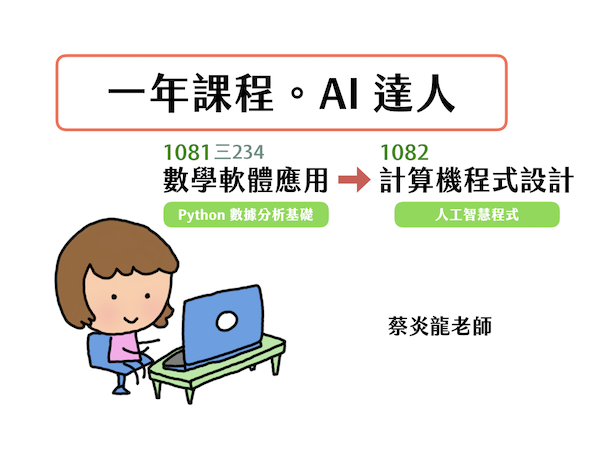

# 2019-2010 政大應數「數學軟體應用」課程

## 簡介
我在政大應數系開設「數學軟體應用」, 自 105 學年度起是以 Python 為主要的程式語言, 主要環境是 Jupyter Notebook, 學習怎麼樣用電腦思考、實驗、實現自己的想法。這一學年的課程中, 上學期「數據分析」為主要的應用, 下學期開始介紹 deep learning 的概念。

108 學年度這個課程再度開設, 不過一個學期是「數學軟體應用」, 一個學期是「程式設計」。藍本和之前一學年「數學軟體應用」大致一樣, 不過在過去同學有困難的部份會加入一些補充。

